<h1 align="center">👋 Hello! I am developomp!</h1>

	
	
	 
	I am a Korean High School graduate who wants to be a developer. 
     

<h2  align="center"><b>Statistics</b></h2>

	

## Skills

<!-- https://github.com/simple-icons/simple-icons/blob/develop/slugs.md -->

### Languages

These are the languages I'm most comfortable working with.

#### Javascript

#### Python

#### C#

### **GUI/front end**

### **Cloud computing platforms**

These are the cloud computing platforms I use/used arranged from most to least familiar

### **Miscellaneous**

These are the language/framework/tools/etc. I've used at least once in any real capacity (i.e. more complex than hello world).

#### Language

#### Game engine

#### Cloud computing

## Proud Projects

### [My blog](https://github.com/developomp/developomp-site)

My blog.

### [Mocha Downloader](https://github.com/Mocha-Downloader)

Makes downloading easier on the internet.

### [War Brokers Mods](https://github.com/War-Brokers-Mods)

A mod for the browser game War Brokers.

### [My setup](https://github.com/developomp/setup)

My Arch Linux setup script.

### [pomky](https://github.com/developomp/pomky)

A conky-like system monitor.

### [Llama Bot](https://github.com/llama-bot)

A discord bot with a web frontend.

## Future projects

Projects I may or may not be able to finish.

### boy-lang

My own programming language.

